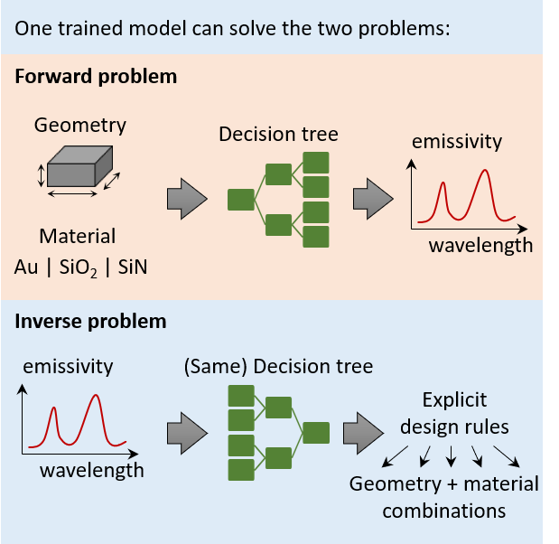

# DT_inverse_design

We show how a decision tree can perform inverse design, and return design rules.

We have applied this idea on the case of designing the spectral emissivity of particles, given material and geometry.

What is inverse design?
given a desired spectral emissivity, the code return particle geometries that can achieve it, along with design rules (i.e., ranges of particle dimensions that can achieve the desired spectral emissivity)

More formal details can be found in our paper:
Interpretable Forward and Inverse Design of Particle Spectral Emissivity Using Common Machine-Learning Models

https://www.sciencedirect.com/science/article/pii/S2666386420302812

This repo is authored by Mahmoud Elzouka and Charles Yang.

# What is in this repo?

- A dataset containing ~30k particles with different materials (Au, SiO2 and SiN), and geometries (spheres, wires, triangular prisms and parallelepiped). For each particle, there is spectral emissivity (i.e., emissivity VS wavelength) and integrated emissivity (i.e., a single number representing emissivity integrated over all wavelength spectrum at a given temperature). You are free to use it with other ML techniques.

- codes that can:
  - build a forward tree-based ML model using either a single decision tree (DT for short) or a an ensemble of decision trees (i.e., a random forest, RF for short)
  - build a single decision tree that has the performance of the random forest, and the interpretability of decision tree. We will this decision tree DTGEN.
  - perform inverse design using DTGEN, and return design rules.

# How to run?

You have two options:

- [recommended] run a single \*.ipynb (i.e., notebook)
  - run the file src\forward_inverse.ipynb
- run \*.py files

  - The first step, run the file "src/forward.py" to create the forward ML models (DT, RF and DTGEN), which will be saved in "./cache"

  - The second step, run the file "src/inverse.py" to perform the inverse design.
